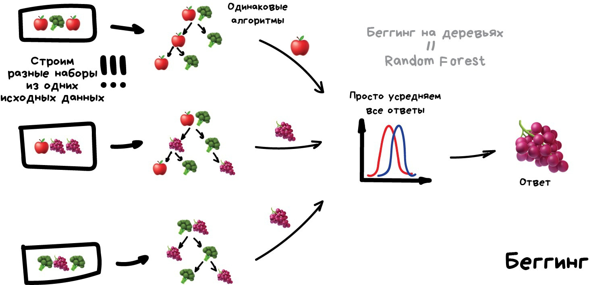
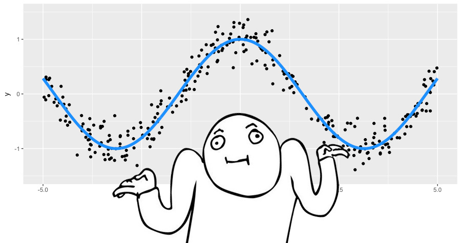
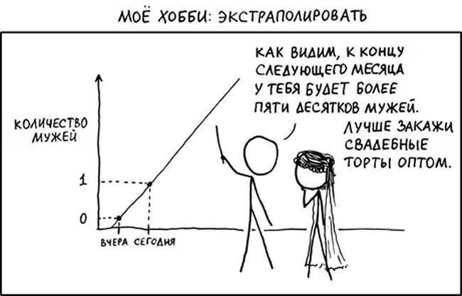
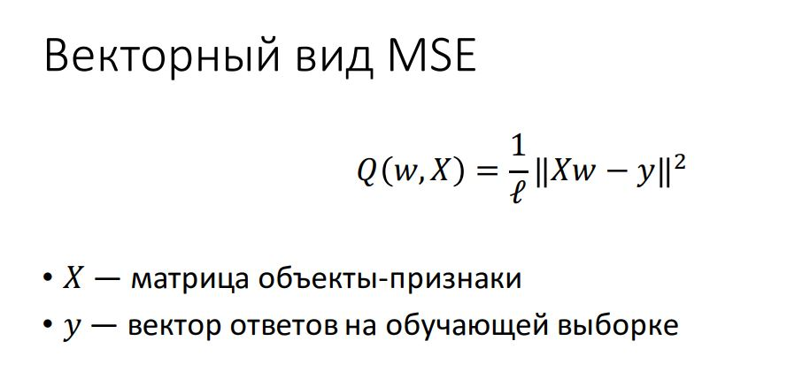

## Что здесь происходит?
*материал на стадии написания*  
  В рамках образовательного проекта [Мамкин Data Scientist](https://t.me/mommyscience) был проведен опрос, на основании которого образовался [ресурс](http://interview-mds.ru/), содержащий распространенные вопросы из собеседований мира Data Science.  
  
  Список постоянно обновляется, пользователи голосуют за популярные вопросы, дают свои трактовки и ответы в комментариях.  
  
  Этот репозиторий представляет собой лонгрид, содержащий выборку из этих вопросов и мои аннотации, не претендующие на полное раскрытие темы, но призванные передать суть ответа простыми словами или натолкнуть на его более глубокое рассмотрение.  
  
  

## Вопросы для интервью по специальности Data Science

### В чем отличие градиентного бустинга над деревьями от случайного леса? Какие базовые параметры настраиваются?  

Оба алгоритма являются ансамблями, но реализуют разные подходы: бустинг и беггинг соотвествтенно.  

 **Ансамбль** - набор из моделей, решающих одну задачу, результаты работы которых компонуются так, чтобы повысить эффективность и точность, в сравнении с прогнозом одной модели.  
 
 **Бустинг** - подход, при котором модели обучаются последовательно.  
 Эта техника использует идею о том, что следующая модель будет учится на ошибках предыдущей. Они имеют неравную вероятность появления в последующих моделях, и чаще появятся те, что дают наибольшую ошибку. Обучающая выборка на каждой итерации определяется, исходя из ошибок классификации на предыдущих итерациях. Из-за того, что предсказатели обучаются на ошибках, совершенных предыдущими, требуется меньше времени для того, чтобы добраться до реального ответа. 
  Плюсы: быстрый и точный
  Минусы: переобучается и не параллелится
   

 **Беггинг** - подход, при котором несколько базовых моделей обучаются параллельно на различных подвыборках, при чем выборка может быть не только срезом строк, но и содержать в себе лишь некотурую часть столбцов (признаков) выбранных случайно. Результаты обучения всех моделей усредняются.  
 Эффективность бэггинга достигается благодаря тому, что базовые алгоритмы, обученные по различным подвыборкам, получаются достаточно различными, и их ошибки взаимно компенсируются при голосовании, а также за счёт того, что объекты-выбросы могут не попадать в некоторые обучающие подвыборки. Случайный лес - беггинг, в основе которого лежат модели деревьев решений.
  Плюсы: довольно точен, устойчив к выбросам
  Минусы: очень большой размер моделей, которые получаются в результате
   
  
  Безовые параметры зависят от типа решаемой задачи (классификация, регрессия) и выбранной базовой модели, в общем случае это количество таких моделей, их ключевые ппраметры (вроде глубины дерева для деревьев решений) и праметры, отвечающие за раелизацию самого подхода (например как разбивать выборки при беггинге).  
  
  Картинки взяты [отсюда](https://vas3k.ru/blog/machine_learning/), крутая статья, рекомендую к прочтению
  
  ### Как вычислить минимальный размер выборки для проведения A/B теста?
  
   Для того чтобы понять, какой объем выборки нам нужен, нам нужно зафиксировать некоторые вещи. Во-первых, минимальный размер эффекта, который мы хотим померить. То есть для нашей метрики, насколько большие отклонения от показателя, который мы предполагаем, сохранится по умолчанию, если наши изменения вообще никак не влияют на пользователей, какой размер вот этого отклонения мы хотим замечать в эксперименте. Эта штука называется «размер эффекта». Далее, следующий показатель, который надо зафиксировать, — это допустимые вероятности ошибок первого и второго рода.  
   
   В A/B-тестах, как правило, мы проверяем гипотезы о том, что никакие наши примененные изменения не повлияли на пользователей вообще никак, и проверяем ее против альтернативы, что как-то повлияли. 
   Ошибкой первого рода в этой ситуации будет отвержение неверной нулевой гипотезы, то есть принятие не влияющих на самом деле на пользователей изменений. Ошибка второго рода — это, наоборот, отклонение действительно хороших и влияющих на пользователей изменений. Вот мы должны, для того чтобы рассчитать необходимый объем выборки, зафиксировать допустимые вероятности ошибок первого и второго рода. В статистике, как правило, используется вероятность ошибки первого рода — 0,05, а вероятность ошибка второго рода — 0,2. В вашем конкретном эксперименте стоимости ошибок первого и второго рода могут быть какими-то существенно разными, поэтому часто может оказаться выгодно вручную выбрать эти пороги на вероятности ошибок первого и второго рода. 
   Наконец, когда вы зафиксировали размер эффекта и допустимой вероятности ошибок, вы можете поступить следующим образом: вы берете название метода, который вы планируете использовать для сравнения ваших контрольных групп и экспериментальных групп, например Z-критерий или T-критерий, и вы используете калькулятор мощности этого критерия. Вообще, для всех статистических критериев между собой связаны сложными взаимосвязями несколько величин: тип альтернативы, размер эффекта, размер выборки и допустимые вероятности ошибок первого и второго рода. Если вы какие-то из этих величин фиксируете, вы можете рассчитать оставшиеся. То есть если вы фиксируете конкретный критерий и фиксируете конкретный тип альтернативы, вероятности ошибок первого и второго рода и минимальный интересующий вас размер эффекта, вы можете вычислить объем выборки, который для этого нужен. Для того чтобы это сделать, нужно использовать калькулятор мощности. Вы просто гуглите его, и для каждого конкретного критерия вы легко найдете десятки различных реализаций, в том числе не требующих никакого знания программирования.
   
 ### Как объяснить бизнесу, что значат ошибки I и II рода?
 
 
 
__Ошибку первого рода__ часто называют *ложной тревогой*, *ложным срабатыванием* или *ложноположительным срабатыванием* — например, анализ крови показал наличие заболевания, хотя на самом деле человек здоров, или металлодетектор выдал сигнал тревоги, сработав на металлическую пряжку ремня. Слово «положительный» в данном случае не имеет отношения к желательности или нежелательности самого события.

__Ошибку второго рода__ иногда называют *пропуском события* или *ложноотрицательным срабатыванием* — человек болен, но анализ крови этого не показал, или у пассажира имеется холодное оружие, но рамка металлодетектора его не обнаружила (например, из-за того, что чувствительность рамки отрегулирована на обнаружение только очень массивных металлических предметов).
 
 
### Какой функционал оптимизируется в задаче линейной регрессии? Как записать это в векторной записи?

    
Осторожно! Баян!

    

Напомню, что __линейная регрессия__ - это метод восстановления зависимости между двумя переменными. Её оптимизация сводится к [максимизации прадоподобия](https://ru.wikipedia.org/wiki/%D0%9C%D0%B5%D1%82%D0%BE%D0%B4_%D0%BC%D0%B0%D0%BA%D1%81%D0%B8%D0%BC%D0%B0%D0%BB%D1%8C%D0%BD%D0%BE%D0%B3%D0%BE_%D0%BF%D1%80%D0%B0%D0%B2%D0%B4%D0%BE%D0%BF%D0%BE%D0%B4%D0%BE%D0%B1%D0%B8%D1%8F), что эквивалентно минимизации среднеквадратичной ошибки (MSE), которая широко используется в реальных задачах.  

### Виды метрик машинного обучения?
(*я так понимаю речь идет о метриках качества*)    
  
За шпорами [сюда](https://stanford.edu/~shervine/teaching/cs-229/cheatsheet-supervised-learning) и [сюда](https://stanford.edu/~shervine/teaching/cs-229/cheatsheet-unsupervised-learning) 

  __Классификация:__
  * accuracy
  * precision 
  * recall
  * F-measure
  * AUC-ROC и AUC-PR
  * Logistic Loss (*Данная метрика нечасто выступает в бизнес-требованиях, но часто — в задачах на kaggle. [Крутая статья](https://dyakonov.org/2018/03/12/%d0%bb%d0%be%d0%b3%d0%b8%d1%81%d1%82%d0%b8%d1%87%d0%b5%d1%81%d0%ba%d0%b0%d1%8f-%d1%84%d1%83%d0%bd%d0%ba%d1%86%d0%b8%d1%8f-%d0%be%d1%88%d0%b8%d0%b1%d0%ba%d0%b8/#more-6139)* )  
  
  __Регрессия__  
  * MSE
  * R<small>2</small> ([Коэффициент детерминации](https://ru.wikipedia.org/wiki/%D0%9A%D0%BE%D1%8D%D1%84%D1%84%D0%B8%D1%86%D0%B8%D0%B5%D0%BD%D1%82_%D0%B4%D0%B5%D1%82%D0%B5%D1%80%D0%BC%D0%B8%D0%BD%D0%B0%D1%86%D0%B8%D0%B8))
  * MAE
  * Квантильная ошибка (*нормальных мануалов не нашел, в двух словах - сильнее штрафует за недопрогноз, чем за перепрогноз)
  
  __Кластеризация__ (*почитать можно [тут](https://habr.com/ru/company/ods/blog/325654/)*)
  * Adjusted Rand Index (ARI)
  * Adjusted Mutual Information (AMI)
  * Homogenity
  * Completeness
  * V-measure
  * Silhouette

### Как объяснить бизнесу метрику машинного обучения?

Больше графиков, красивая диграмма, три раза сказать *"business value"*, можно подключать мимику.

На этот вопрос нет истинно верного ответа, я хотел написать о использовании интерпретируемых моделей, где на язык бизнеса можно перенести веса признаков в сетях/линейных алгоритмах или feature importance моделей на базе деревьев решений. Или упомянуть о силе аллегорий.. но не уверен, что таким вещам тут место. Но раз уж есть мемасик, то вопрос определенно стоит включить.

### Mean/median/mode — что это?  
(*Рекомендую к прочтению книгу В. Савельева "Статистика и котики"*)  

__Mean__ - среднее значение, полученное путем деления суммы элементов на их количество.  
__Median__ - медиана это число в середине выборки чисел: половина данных находится ниже этого значения, а половина выше.  
__Mode__ - мода, соответствующая значению, которое встречается чаще всего.  

